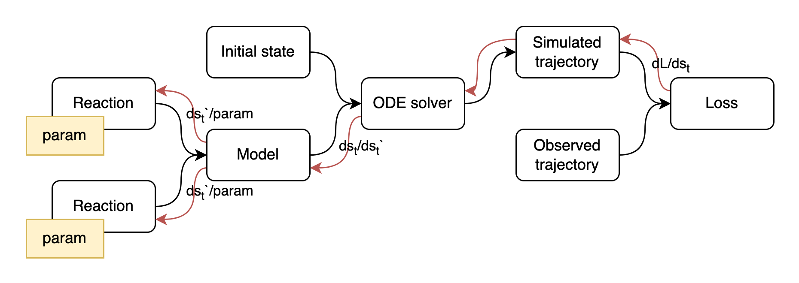

# torch-kinetics
A minimalistic package for implementing differentiable Enzyme Kinetics models with PyTorch framework.
The interfaces in this package are partially based on `kinetics` package.
Please refer to its [documentation](https://kinetics.readthedocs.io/en/latest/index.html) for the illustrated 
explanation of Enzyme Kinetics models.

## Main Idea
In essence, Enzyme Kinetics models are collections of ODEs applied to the sub-parts of a system's state.
The state represents concentration of metabolites in a biological system.
If we implement Enzyme Kinetics model with support of backpropagation, combined with the differentiable ODE solver
one would be able to fit model's parameters to the observed trajectories of changes in metabolite concentrations:

 

## Examples
This [notebook](examples/restore_kinetics_model.ipynb) provides an example of tuning model parameters by fitting
simulated trajectory to the trajectory recorded with `kinetics` package.